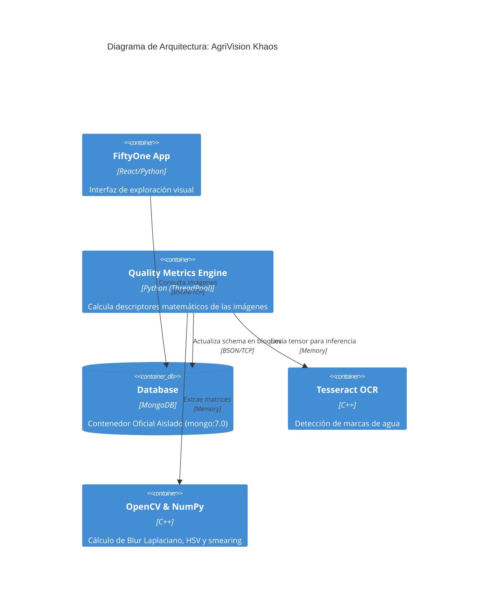

# Project Architecture

## Overview
El proyecto `AgriVision Khaos` es un nodo para la auditoría, deduplicación y filtrado de calidad de imágenes agrícolas. Ingiere fuentes compatibles COCO, YOLO, VOC y árboles de clasificación, conserva su procedencia y utiliza visión por computador y OCR para identificar ruido y casos que requieren revisión.

## Components Diagram

## Technologies
- **Backend Core**: Python 3.13, gestionado con `uv`.
- **Base de Datos**: MongoDB (Standalone Container).
- **Visión Artificial**: OpenCV, NumPy, PIL.
- **Modelos OCR**: Tesseract OCR (vía `pytesseract`).
- **Data Curation Framework**: Voxel51 (FiftyOne).

## Design Decisions
- **Decodificación única**: Cada worker lee los bytes una vez y los decodifica con OpenCV; validación y métricas reutilizan esa misma matriz.
- **Multithreading vs Multiprocessing**: Se emplea `ThreadPoolExecutor` con OCR residente en memoria para evitar colapsar la RAM de la máquina host con múltiples instancias del modelo Tesseract.
- **Batched DB Updates**: En lugar de consultar `dataset[id]` por cada iteración (lo que causa timeouts en MongoDB), las métricas se agrupan en lotes de 10.000 imágenes y se escriben de una sola vez con `dataset.set_values()`.
- **Despliegue Docker**: El ecosistema (FiftyOne y Scripts) se ha dockerizado para independizarse de los problemas de compilación de OpenCV y Tesseract en la máquina host.
- **Publicación fail-closed**: Una fase habilitada que falla aborta la ejecución. Las exportaciones se construyen en un directorio temporal y solo se publican con `_SUCCESS` tras completarse todas.
- **Datos originales inmutables**: El árbol `/datasets/raw` se monta como solo lectura. Los registros de FiftyOne apuntan a esas rutas; la ingesta no copia ni modifica el material original.
- **Tareas explícitas**: Un esquema canónico conserva `task_type`, origen, split y anotaciones. Los exportadores filtran las muestras compatibles en lugar de mezclar clasificación y detección como una tarea homogénea.
