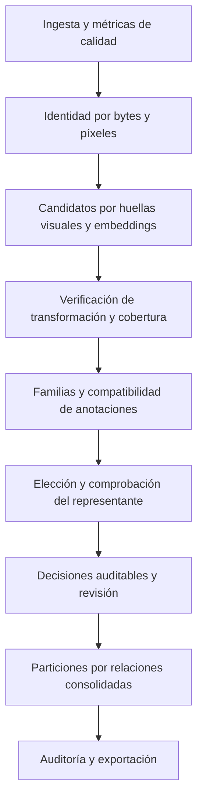

# Plan para detectar variantes de una foto y conservar la mejor

Evaluación del 7 de septiembre de 2026. Estado: cierre de ingeniería del alcance conservador el 8 de septiembre de 2026; aceptación de dominio y activación aproximada pendientes.

El objetivo acordado es identificar imágenes derivadas de una misma captura,
conservar su mejor representante y evitar que sus variantes se repartan entre
entrenamiento, validación y prueba. Una foto diferente de la misma hoja no se
considerará automáticamente una aumentación. Tampoco se descartará una imagen
única solo porque parezca transformada.

## 1. Evaluación inicial (antes de los cambios)

Esta sección conserva los hallazgos y referencias de la revisión inicial; las
líneas citadas pertenecen a aquella versión.

El repositorio ya ofrece una base útil: separación de ingesta, calidad y
deduplicación, originales montados en solo lectura, procedencia por fuente,
conflictos de etiquetas enviados a revisión, exportación transaccional y
particiones por grupos. Los perfiles YAML usan `augmentation_action: review`.
La mejora debe aprovechar estas piezas.

| Prioridad | Hallazgo y evidencia | Consecuencia |
| --- | --- | --- |
| P0 | `compute_color_embeddings()` y `detect_augmentation_duplicates()` en `src/agrivision_khaos/deduplication.py:356–410` usan únicamente histogramas HSV de 512 componentes y distancia coseno. | El color propone candidatos, pero no demuestra identidad espacial. Cambios de color o recortes también pueden escapar al detector. |
| P0 | `run_duplicate_phases()` en `src/agrivision_khaos/pipeline.py:938–1008` asigna confianza 0,99 al seleccionar `remove`; `apply_second_opinion()` solo rebaja descartes con confianza inferior a 0,98. | Cambiar la acción convierte una heurística en una decisión que elude el límite de descarte masivo, sin aportar evidencia adicional. También afecta al método semántico. |
| P0 | `process_duplicates()` en `src/agrivision_khaos/deduplication.py:175–256` escribe los mismos campos de clúster y representante en cada fase, sin consolidar las relaciones anteriores ni limpiar todos los valores obsoletos. | Una fase posterior o una repetición puede dejar agrupaciones que ya no describen todas las relaciones detectadas. |
| P0 | `_split_group_key()` en `src/agrivision_khaos/pipeline.py:1421–1426` elige el primer identificador disponible. | Un clúster de duplicados desplaza a `capture_group` o `video_id`; no se combinan las restricciones para mantener juntas imágenes relacionadas. |
| P1 | `_sample_keep_score()` en `src/agrivision_khaos/deduplication.py:106–124` compara una tupla: nombre de archivo, padding y área preceden a la nitidez. `_get_padding_ratio()` cuenta todos los píxeles casi blancos o negros. | Una diferencia en un criterio anterior domina a todos los posteriores. Los fondos legítimos pueden penalizarse y el nombre no acredita que una imagen sea la original. |
| P1 | `_label_signature()` compara conjuntos de clases; `process_duplicates()` forma componentes transitivas y elige un representante global. | Coincidir en clases no garantiza equivalencia de cajas, máscaras o tareas. A≈B y B≈C no verifican que A pueda sustituir a C. |
| P1 | Las distancias se descartan al construir `duplicates_dict`; el reporte representa parejas como conservada/eliminada incluso cuando quedan en revisión. | Falta evidencia para justificar cada sustitución y el informe puede dar una impresión incorrecta del resultado. |
| P1 | `--method augmented --delete` llama a `delete_samples()`; `make deduplicate` usa `--inspect`, que requiere un índice previo para este método. | El comando independiente no comparte el flujo completo de decisiones del pipeline y la primera inspección puede fallar. Se eliminan registros de FiftyOne, no los archivos originales. |
| P2 | La extracción HSV es secuencial, relee imágenes y reconstruye su índice al ejecutar el detector; una imagen ilegible recibe un vector cero. | Hay trabajo repetido y entradas sin descriptor válido. El checkpoint global existente no proporciona caché incremental por imagen. |

La prueba aislada de `apply_second_opinion()` con las funciones reales del
repositorio y objetos simulados confirmó que 9 descartes sobre 10 muestras siguen
en `removed` con confianza 0,99, pese a límites de 0,40 por fase y 0,65 acumulado.
Con confianza 0,75 pasan a `review`. También se comprobó que dos muestras con el
mismo `capture_group` obtienen claves de partición diferentes si sus clústeres
difieren. Esto demuestra la separación de claves, no una fuga observada en un
dataset real.

En la evaluación inicial no había imágenes reales en `data/raw/`. El Python local carece de OpenCV, FiftyOne
y Pydantic; no se ejecutó la suite completa ni se midieron precisión o velocidad.
Las pruebas existentes cubren reglas, agrupación, conflictos e integración, pero
no hay un benchmark de detección de familias con rotaciones y espejos.

## 2. Flujo propuesto

La búsqueda debe cruzar fuentes y splits originales. La etiqueta servirá para
comprobar compatibilidad, sin impedir descubrir duplicados mal etiquetados.
Una coincidencia de color o de embedding será una propuesta; una decisión de
sustitución exigirá evidencia adicional.

## 3. Entregas ordenadas

### Entrega 1 — Corregir las decisiones y crear la referencia de evaluación

Archivos: `models.py`, `pipeline.py`, `deduplication.py`, ambos YAML, documentación
del flujo y pruebas de reglas/integración.

- Separar acción solicitada, puntuaciones medidas y nivel de evidencia. Un
  `remove` solicitado no aumentará la confianza. Definir explícitamente qué
  coincidencias exactas pueden eludir límites y con qué validación de anotaciones.
- Mantener en revisión las coincidencias por histogramas o embeddings sin verificar.
  El comando independiente usará la misma política y decisiones persistidas.
- Crear familias de prueba reproducibles: original, giros 90/180/270°, espejos,
  rotaciones con relleno, escalado, JPEG, brillo, contraste y recorte. Añadir
  negativos difíciles: hojas distintas con colores iguales, fondos repetidos,
  texturas similares e imágenes de baja información.
- Incluir originales ausentes, nombres engañosos, alfa, archivos ilegibles y
  anotaciones incompatibles. Añadir un conjunto real revisado, separado por
  captura de los ejemplos usados para ajustar parámetros.
- Medir el detector actual: precisión de parejas, recuperación por transformación,
  familias mezcladas, carga de revisión y tiempo/memoria. Conservar los resultados
  como línea base; no fijar un nuevo umbral global sin esa medición.

Aceptación: el caso de 9/10 descartes heurísticos se deriva a revisión; ninguna
coincidencia solo por color se retira automáticamente; los fixtures y la línea
base quedan reproducibles. Corregir las afirmaciones documentales de que el
histograma demuestra identidad o que el perfil actual siempre elimina variantes.

### Entrega 2 — Recuperar candidatos con señales complementarias

Archivos: `deduplication.py`, `quality.py` y un módulo específico de descriptores
si su tamaño lo justifica; configuración y pruebas de aumentaciones.

- Reutilizar `asset_sha256` para identidad de archivo cuando su vigencia esté
  verificada. Añadir identidad de píxeles decodificados con orientación, alfa,
  dimensiones y versión de normalización explícitas.
- Para giros de 90° y espejos, calcular una huella canónica entre las ocho
  transformaciones discretas. La coincidencia exacta se verificará sin reducir
  resolución ni eliminar contenido antes de tratarla como equivalencia fuerte.
- Añadir huellas perceptuales de esas transformaciones para recuperar variantes
  recodificadas o escaladas. Combinar sus candidatos con HSV y los embeddings
  existentes; la combinación inicial será una unión para medir qué aporta cada señal.
- Usar vecinos limitados por imagen y procesamiento por lotes. Medir el recall
  del límite de vecinos: una familia grande no debe desaparecer silenciosamente.
- Identificar descriptores inválidos o de baja información y enviarlos al flujo
  correspondiente; no indexar vectores cero como si fueran descriptores válidos.

La implementación de pHash de OpenCV está en `opencv_contrib`; el proyecto instala
`opencv-python-headless`. La entrega debe resolver explícitamente esta dependencia:
prototipar una huella DCT con las primitivas actuales o evaluar la sustitución del
paquete, evitando instalar dos distribuciones que compitan por `cv2`.
[Referencia oficial de pHash](https://github.com/opencv/opencv_contrib/blob/4.x/modules/img_hash/src/phash.cpp).

Aceptación: todas las transformaciones discretas sin pérdida del fixture aparecen
como candidatas; JPEG y escalado se evalúan por separado; ninguna huella perceptual
por sí sola autoriza un descarte. Esta ruta básica funciona sin GPU ni modelos.

### Entrega 3 — Verificar que una imagen deriva de la otra

Archivos: módulo de verificación visual, `deduplication.py`, `models.py` y pruebas.

- Alinear primero los candidatos bajo giros y espejos explícitos. Para variantes
  más generales, evaluar puntos locales ORB/AKAZE y ajuste geométrico robusto,
  empezando por transformaciones restringidas de rotación, escala y traslación.
- Medir correspondencias válidas, distribución espacial, error geométrico,
  cobertura útil en ambas imágenes y parecido de estructura tras la alineación.
  Una homografía flexible no bastará para demostrar una aumentación.
- Comprobar la región de la hoja y las anotaciones para evitar confirmar parejas
  solo por el fondo. Comparar también contenido no solapado: un recorte puede
  contener una lesión o anotación que el representante no conserve.
- Guardar para cada pareja: IDs estables, método, distancias, transformación,
  cobertura, resultado de verificación y versiones de descriptor/verificador.
- Si faltan textura, cobertura o correspondencias suficientes, mantener el caso
  pendiente. Excluir del descarte automático inicial recortes importantes,
  cambios intensos de color, mezclas de imágenes y deformaciones no rígidas.

OpenCV documenta correspondencias ORB/AKAZE y estimación con RANSAC. Su adaptación
a la verificación de aumentaciones agrícolas es una propuesta que se validará
con el benchmark, no una garantía derivada del tutorial.
[Referencia oficial de correspondencias](https://docs.opencv.org/4.12.0/dc/d16/tutorial_akaze_tracking.html).

Aceptación: los negativos con histograma idéntico no se confirman por ese motivo;
cada coincidencia confirmada tiene evidencia geométrica y de contenido; se
informa de precisión y recuperación por fuente y transformación.

### Entrega 4 — Consolidar familias y conservar el mejor representante

Archivos: `deduplication.py`, `pipeline.py`, `models.py` y pruebas de familias.

- Persistir evidencias por método y construir una familia consolidada sin
  sobrescribir resultados anteriores. Regenerar asignaciones y retirar valores
  obsoletos de forma controlada al cambiar política o datos.
- Diferenciar familia de variantes confirmadas y grupo usado para evitar fugas.
  Los candidatos ambiguos pueden imponer una agrupación conservadora de splits,
  con su motivo registrado, sin convertirse por ello en duplicados confirmados.
- Seleccionar solo entre candidatos elegibles. Ordenar por integridad, validez y
  cobertura de anotaciones, contenido conservado, nitidez comparable y resolución
  útil. Medir padding en bordes y esquinas respetando fondos legítimos y alfa.
  El nombre de archivo será una pista secundaria, nunca una prueba de originalidad.
- Verificar directamente cada imagen que se proponga retirar contra el
  representante elegido. Si A coincide con B y B con C, no retirar C por A sin
  esa comprobación. Mantener varios representantes cuando no haya sustituto completo.
- Conservar procedencia y anotaciones de todos los miembros. Misma clase con
  cajas diferentes, o clasificación frente a detección, requerirá resolución por
  tarea; una única copia física no implica perder registros de anotación.
- Si falta la original, conservar la mejor variante válida sin llamarla original
  recuperada. Si ninguna es apta, enviar la familia a revisión sin forzar un `kept`.
- Acumular motivos de revisión de calidad, etiquetas y duplicidad para que resolver
  una causa no apruebe inadvertidamente las demás.

Aceptación: selección estable ante cambios del orden de entrada y reingesta con
los mismos activos; ninguna familia válida pierde todos sus representantes; el
caso A–B–C no provoca una retirada sin verificación directa; un sufijo no derrota
por sí solo a una imagen de mayor calidad; se preservan anotaciones compatibles.

### Entrega 5 — Particiones, revisión y exportación auditables

Archivos: `pipeline.py`, `export.py`, `ingest.py` cuando se incorporen metadatos de
captura, `Makefile` y documentación de inspección/exportación.

- Construir grupos de partición combinando relaciones de familia, captura y vídeo
  disponibles. Evitar que una relación sustituya a otra por prioridad de campos;
  dar ámbito por fuente a IDs locales. Tratar ubicación según una política explícita,
  ya que no equivale necesariamente a una única captura.
- Añadir auditoría antes de publicar: cada relación que exige compartir split
  debe respetarse. Revisar candidatos visuales entre splits e informar del riesgo
  residual; bloquear la publicación si una familia confirmada cruza particiones.
- Exportar `family_id`, representante, relación con él, versión de política y
  motivos de decisión en manifiestos y evidencias. Usar identidades de activo y
  procedencia estables para no depender exclusivamente de IDs de MongoDB.
- Mostrar original/variante solo cuando se conozca ese origen; en los demás casos,
  representante/candidato, con su estado real: conservado, revisión o descartado.
  Añadir comparación alineada y motivos de elección.
- Permitir aprobar, dividir o rechazar familias en la revisión y recomputar las
  restricciones afectadas. Toda retirada lógica apuntará a un representante válido.
- Separar detección e inspección en `Makefile`, o construir el índice si falta.
  Revisar resultados persistidos sin recalcular con otro umbral al aplicar decisiones.

Aceptación: cero relaciones confirmadas entre splits distintos; pruebas de
solapamientos entre métodos y captura, reejecución, aprobación manual y exportación
COCO/YOLO/clasificación. Los originales siguen intactos y un fallo de auditoría
impide publicar `_SUCCESS`.

### Entrega 6 — Rendimiento y activación gradual

Archivos: módulos de descriptores/verificación, `execution.py`, configuración,
pruebas de reanudación y documentación operativa.

- Cachear descriptores por contenido y versión, reutilizar lectura/decodificación
  donde sea posible y guardar descriptores en lotes. Usar `float32` cuando proceda.
- Persistir verificaciones por pareja y configuración, invalidar cachés al cambiar
  datos o algoritmo y reanudar desde subfases compatibles. Aprovechar los
  checkpoints existentes sin confundirlos con resultados válidos de otra versión.
- Medir imágenes/segundo, comparaciones/imagen, memoria máxima, tiempo de índices,
  reutilización de caché y coste de revisión en tamaños crecientes.
- Ejecutar primero en modo informe, comparando decisiones actuales y propuestas.
  Activar descarte automático únicamente para transformaciones y dominios validados;
  los demás seguirán en revisión. Conservar el registro necesario para revertir
  decisiones y regenerar la exportación.

Aceptación: una segunda ejecución compatible reutiliza descriptores y verificaciones;
no se construye una matriz densa global de todas las parejas; el consumo cabe en
la máquina objetivo y un fallo parcial se recupera con resultados consistentes.

## 4. Criterios para activar el descarte automático

| Medida | Criterio propuesto |
| --- | --- |
| Precisión de sustituciones automáticas | Objetivo inicial ≥99,5 % en evaluación real reservada; informar tamaño de muestra e intervalo de confianza. Si la evidencia es insuficiente, mantener revisión. |
| Recuperación | Medir por transformación, fuente y familia; objetivo inicial ≥95 % para giros/espejos y recodificación dentro del rango validado. Es un objetivo de evaluación, no una prestación actual. |
| Elección del representante | Cumplir todos los casos controlados de integridad, nitidez, cobertura, nombres engañosos y original ausente; auditar desacuerdos humanos en el conjunto real. |
| Pérdida de información | Cero retiradas automáticas en los casos controlados con contenido o anotaciones exclusivos sin preservar. |
| Fugas conocidas | Cero familias confirmadas repartidas entre train/val/test; registrar relaciones ambiguas y límites del detector. |
| Reproducibilidad | Mismos activos, política y versiones producen las mismas familias y decisiones, incluida una reanudación. |
| Trazabilidad | Toda retirada identifica evidencia y representante conservado; exportación consistente con la revisión. |

El tamaño de evaluación debe justificar el objetivo de precisión y representar
los dominios usados. Cero errores en unas pocas imágenes sintéticas no demuestra
una tasa de error real baja. Además de precisión, medir qué proporción se retira
automáticamente para evitar una aparente mejora obtenida enviándolo todo a revisión.

## 5. Primer alcance implementable

Empezar con las correcciones P0, el benchmark y la ruta CPU de giros de 90°,
espejos, escalado y recodificación. Integrar verificación, selección y auditoría
de splits antes de habilitar su descarte automático. Dejar recortes importantes
y transformaciones complejas en revisión mientras se recoge evidencia.

Las entregas 1 a 6 constituyen una secuencia de cambios revisables. El acceso a
un conjunto real revisado es necesario para calibración y activación; las
correcciones de reglas y las pruebas reproducibles pueden comenzar con los
fixtures locales. La limpieza de defectos visuales se reutiliza como criterio
de selección del representante, de acuerdo con el objetivo elegido.

## 6. Cierre de implementación (8 de septiembre de 2026)

Este documento se conserva como especificación y registro de aceptación. El
alcance conservador es utilizable; **no se declara perfección ni cumplimiento
empírico de los objetivos agrícolas**. La ausencia del dataset real impide esa
aceptación, no las pruebas de ingeniería. La operación está documentada en
[deduplicación](workflow/2_deduplication.md).

| Entrega | Implementado y comprobable localmente | Aceptación que sigue abierta |
| --- | --- | --- |
| 1. Reglas y referencia | Evidencia separada de acción, protecciones de descarte, fixtures reproducibles, referencia HSV, fallos explícitos ante manifiestos incompletos. | Conjunto agrícola reservado y evaluación de sustituciones humanas. |
| 2. Candidatos | Bytes y píxeles completos D4, pHash DCT, HSV, unión con propuestas semánticas, índice acotado y referencia exhaustiva, métricas de truncamiento, descriptores inválidos/poco informativos en revisión. | Recall del índice en la distribución y volumen del trabajo. La conectividad exacta no depende del límite. |
| 3. Verificación | Comparación D4/escalado/JPEG por regiones; ORB mutuo, afín restringida, reproyección, distribución de puntos, cobertura bilateral, contenido texturado no solapado y vista alineada. | Los gradientes no identifican hojas ni lesiones. Su conservación específica no está validada; recortes y geometrías complejas no se habilitan para retirada automática. |
| 4. Representantes | Relaciones por método, familias confirmadas y grupos conservadores, elegibilidad y calidad antes del nombre, comprobación directa, protección de cajas/máscaras/atributos, razones acumuladas y reejecución estable. | Preferencia del representante y utilidad agronómica revisadas en datos reales. Las tareas no comparables requieren revisión. |
| 5. Revisión/exportación | Unión de familias/captura/vídeo, ubicación opt-in, auditoría de relaciones y auditoría visual nueva entre splits, revalidación de sustituciones actuales, historial, reset, manifiestos, procedencia y anotaciones. CLI probado con detección/repetición/reset. | Revisar las relaciones ambiguas detectadas y el riesgo residual de variantes no recuperadas. |
| 6. Operación | Caché por contenido/versión/configuración con checksum y validación, miniaturas externas e histogramas float32, recuperación tras caché dañada, locks del detector, métricas de índice/verificación, medición fría/caliente, evaluación sin mutar datasets. | Capacidad de la máquina objetivo y activación aproximada por dominio. No se habilitó retirada heurística. |

### Correcciones adicionales de la revisión final

- Normalización de parejas para impedir contar una misma relación en ambos sentidos.
- Restauración del estado previo al repetir el detector independiente, manteniendo
  evidencias de otros métodos y revisiones humanas.
- Revisión de imágenes aisladas de baja información.
- Validación de tags humanos y proporciones de split antes de mutar esos estados.
- Historial de decisiones y relaciones; reversión de decisiones automáticas.
- Auditoría de activos descartados antes de exportar, también al reanudar: una
  sustitución obsoleta por cambios de contenido o anotaciones bloquea la publicación.
- Reconciliación de representantes después de la fase de etiquetas.

### Evidencia reproducible

Los resultados medidos están en
[augmentation_synthetic.json](benchmarks/augmentation_synthetic.json). No se
incluyen imágenes generadas ni cachés en el repositorio.

| Prueba | Resultado |
| --- | --- |
| 90 imágenes, comparación con búsqueda exhaustiva | 630 parejas candidatas únicas, 270 confirmadas, 0 falsos positivos de identidad; recuperación del 100 % de las parejas confirmadas de la referencia. |
| 900 imágenes, índice con presupuesto 512 | 9586 parejas candidatas, 2179 confirmadas, 0 falsos positivos de identidad; 100 % de miembros D4, JPEG y escalado recuperados. |
| 900 imágenes, rendimiento observado | 168,65 s en frío y 2,84 s en caliente; máximo de proceso 109,55 MiB y 91,37 MiB respectivamente. |
| 900 imágenes, caché | Segunda ejecución: 900 descriptores y 9586 parejas reutilizados; mismos recuentos por nivel. |
| 900 imágenes, límites visibles | 132702 vecinos puntuados; 900 consultas con truncamiento de buckets y 316 imágenes saturando vecinos. No se midió aquí el recall de todas las parejas contra la referencia exhaustiva. |
| Referencia HSV sobre 90 imágenes | 470 parejas, 112 incorrectas; compara la señal de color, no todo el pipeline anterior. |

La cifra histórica de 290 parejas confirmadas incluía algunas parejas en ambos
sentidos; la normalización deja 270 parejas únicas. El informe actualizado usa
parejas únicas. Los 6 grupos del piloto son insuficientes para certificar una
precisión del 99,5 %. El intervalo publicado mide consistencia por familia bajo
supuestos explícitos; no es un intervalo de seguridad de sustituciones.

### Pendiente para aceptación en la máquina de trabajo

1. Preparar familias agrícolas revisadas, negativos difíciles, fuente y captura,
   con evaluación separada de calibración. El benchmark acepta ambos manifiestos
   y detecta solapamientos declarados y equivalencias exactas de píxeles.
2. Ejecutar con la política que se usará, comparar el índice en pilotos y medir
   tamaños crecientes. Revisar truncamientos, carga de revisión y memoria.
3. Auditar sustituciones y conservación de lesiones/anotaciones por tarea y dominio.
   El benchmark de identidad no sustituye esa revisión.
4. Mantener revisión para coincidencias aproximadas. El código **no ofrece un
   interruptor para certificar o activar retiradas aproximadas** a partir de
   resultados sintéticos; hacerlo exige otro cambio sustentado por evaluación real.

Estos puntos mantienen abiertos los criterios de activación de la sección 4.
El plan no debe borrarse como si todos sus objetivos empíricos estuvieran cumplidos.

### Comprobaciones de entrega

- 85 pruebas unitarias y de integración aprobadas, con MongoDB temporal aislado.
- Compilación de `src` y `tests` y Ruff con las reglas de CI sin errores.
- `git diff --check` limpio y target de benchmark comprobado.
- No se requieren dependencias nuevas ni cambios en `uv.lock`.
- No se hizo commit ni push; los módulos nuevos deben incluirse al subir los cambios.
